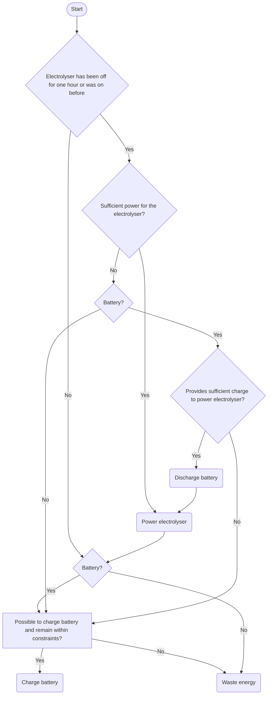

# Hydrogen Simulation Flowchart
Below is a flowchart to illustrate how the script in [`Simulate_Hydrogen_Production.ipynb`](Scripts/Simulate_Hydrogen_Production.ipynb) simulates the production of hydrogen. 
